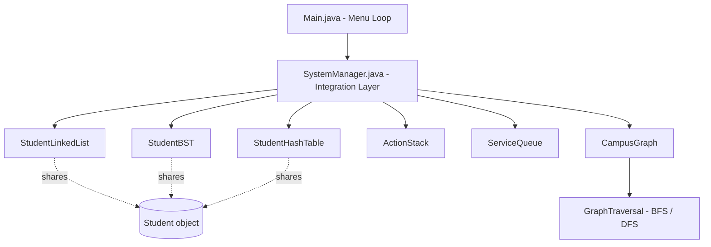

<div align="center">

# University Student Record & Campus Route Management System

### A console-based Java application demonstrating linked lists, stacks, queues, trees, hashing, and graphs in one integrated system.


**CIT300 — Data Structures and Algorithms** · Graded Practical Assignment 1 (Week 10)

</div>

---

## Table of Contents

- [Overview](#overview)
- [Features](#features)
- [Architecture](#architecture)
- [Project Structure](#project-structure)
- [Getting Started](#getting-started)
- [Usage](#usage)
- [Requirements Coverage](#requirements-coverage)
- [Testing](#testing)
- [Team](#team)
- [Git Workflow](#git-workflow)
- [License](#license)

---

## Overview

This project simulates two connected real-world systems for a university campus:

| System | Purpose |
|---|---|
| **Student Records** | Manage student data — add, update, delete, search, and display, using a genuine combination of linked lists, stacks, queues, trees, and hash tables |
| **Campus Route Network** | Model campus locations and paths as a graph, supporting live editing and traversal via BFS/DFS |

Every data structure taught in the module is put to real, working use — not simulated, not faked. The project was built, compiled, and tested end-to-end before submission.

---

## Features

- Full CRUD for student records (add / update / delete / search / display)
- Custom singly linked list for ordered record storage
- Custom stack (LIFO) for an undo-style action history
- Custom queue (FIFO) for service request processing
- Binary Search Tree for records sorted by Student ID
- Hash table built from scratch (separate chaining with automatic resizing) for average O(1) lookups
- Graph-based campus network with adjacency list representation
- Both BFS and DFS traversal implemented
- Input validation across every operation — duplicate IDs, invalid marks, missing records, and unavailable connections are all handled gracefully
- Clean, menu-driven console interface

---

## Architecture

Each core module owns exactly one data structure and exposes a small, focused API. `SystemManager` is the single integration layer that coordinates them — nothing else in the codebase touches more than one module directly.



Design principle: adding a student creates one `Student` object, which is then referenced — not copied — by the linked list, BST, and hash table simultaneously. Updating a student's details through any one path is instantly reflected everywhere, because all three structures point to the same object in memory.

---

## Project Structure

```
UniversityStudentRecordSystem/
├── src/
│   ├── common/
│   │   ├── Student.java            Shared data model
│   │   └── InputValidator.java     Shared validation helpers
│   │
│   ├── studentrecords/             Linked List module
│   │   ├── StudentNode.java
│   │   └── StudentLinkedList.java
│   │
│   ├── actionsqueue/               Stack & Queue module
│   │   ├── ActionRecord.java
│   │   ├── ActionStack.java
│   │   ├── ServiceRequest.java
│   │   └── ServiceQueue.java
│   │
│   ├── searchindex/                BST & Hashing module
│   │   ├── BSTNode.java
│   │   ├── StudentBST.java
│   │   └── StudentHashTable.java
│   │
│   ├── campusgraph/                Graph module
│   │   ├── CampusGraph.java
│   │   └── GraphTraversal.java
│   │
│   └── app/
│       ├── Main.java                Menu loop only — no business logic
│       └── SystemManager.java       Integration layer
│
├── README.md
├── .gitignore
└── .gitattributes
```

---

## Getting Started

### Prerequisites

- JDK 17 or later ([Adoptium](https://adoptium.net) recommended)

Verify your installation:
```bash
javac -version
```

### Build

```bash
javac -d out $(find src -name "*.java")
```

Windows PowerShell:
```powershell
javac -d out (Get-ChildItem -Recurse -Filter *.java -Path src).FullName
```

### Run

```bash
java -cp out app.Main
```

---

## Usage

On launch, the system presents a 16-option menu:

```
=====  University Student Record and Campus Route Management System  =====
 1. Add Student Record                  9. Search Student using Hashing
 2. Update Student Record               10. Add Campus Location
 3. Delete Student Record                11. Remove Campus Location
 4. Display All Records (Linked List)    12. Add Campus Connection/Road
 5. Add Service Request to Queue         13. Remove Campus Connection/Road
 6. Process Next Service Request         14. Display Campus Connections
 7. Display Recent Actions (Stack)       15. Traverse Campus (BFS/DFS)
 8. Display Students (BST/AVL)           16. Exit
```

Enter a number and follow the prompts.

---

## Requirements Coverage

Every requirement from the assignment brief is mapped to a specific implementation:

| # | Requirement | Implementation |
|:-:|---|---|
| 1 | Store Student ID, Name, Programme, Marks | `common.Student` |
| 2 | Linked list to store/manage records | `studentrecords.StudentLinkedList` |
| 3 | Stack for recent actions / undo history | `actionsqueue.ActionStack` |
| 4 | Queue for service requests, arrival order | `actionsqueue.ServiceQueue` |
| 5 | BST/AVL to organize/search by Student ID | `searchindex.StudentBST` |
| 6 | Hashing for efficient ID search | `searchindex.StudentHashTable` |
| 7 | Graph representing campus locations/roads | `campusgraph.CampusGraph` |
| 8 | Adjacency list or matrix | Adjacency list |
| 9 | Add/remove locations and connections | `CampusGraph` methods |
| 10 | Display connected locations / network | `CampusGraph.displayConnections()` |
| 11 | At least one graph traversal (BFS/DFS) | `campusgraph.GraphTraversal` — both implemented |
| 12 | Add/update/delete/search/display for records | `SystemManager` + modules above |
| 13 | Menu-driven interface with input validation | `app.Main` + `common.InputValidator` |
| 14 | Handle invalid input, duplicates, missing records | Validation throughout every module |

---

## Testing

The system was manually verified against the following scenarios before submission:

- [x] Duplicate Student ID rejected on add
- [x] Update/delete of a non-existent ID handled gracefully
- [x] Service queue processes requests in arrival (FIFO) order
- [x] Action stack displays history most-recent-first (LIFO)
- [x] Hash table search returns correct results and handles "not found"
- [x] BST display always shows records sorted by Student ID
- [x] Removing a campus location also removes its connections
- [x] BFS and DFS both produce valid, correct traversal orders
- [x] Invalid menu input (letters, out-of-range numbers) does not crash the program

---

## Team

| Member | Name | Student ID | Module | Responsibility |
|:-:|---|:-:|---|---|
| Member 1 | Prabhath | `23DA2-0414` | Linked List | Student record CRUD operations |
| Member 2 | Haritha | `23DA2-0421` | Stack & Queue | Action history and service request handling |
| Member 3 | Hasindu | `23DA2-0150` | BST & Hashing | Ordered search and fast ID lookup |
| Member 4 | Vinod | `23DA2-0464` | Graph | Campus network modeling and traversal |

All members contributed to integration, testing, debugging, and documentation.

---

## Git Workflow

This project was developed using a standard feature-branch workflow:

1. Each member developed on their own branch (`feature/student-linkedlist`, `feature/stack-queue`, `feature/bst-hashing`, `feature/campus-graph`)
2. Work was committed incrementally with descriptive messages
3. Pull Requests were opened and reviewed before merging into `main`
4. `SystemManager.java` was updated after each merge to wire the new module in

---

## License

This project was developed for academic purposes as part of the CIT300 Data Structures and Algorithms module.
